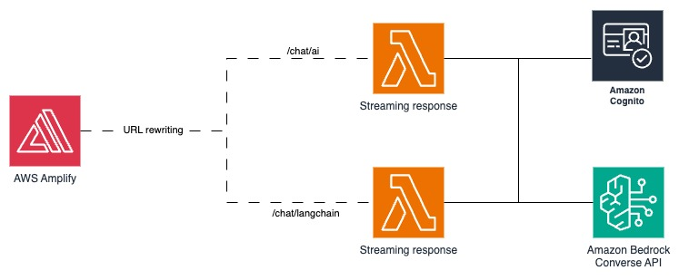
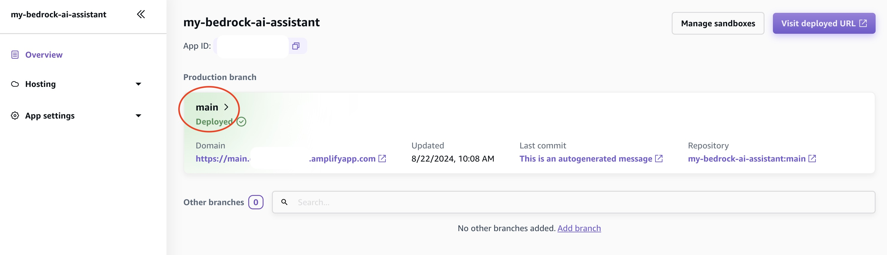
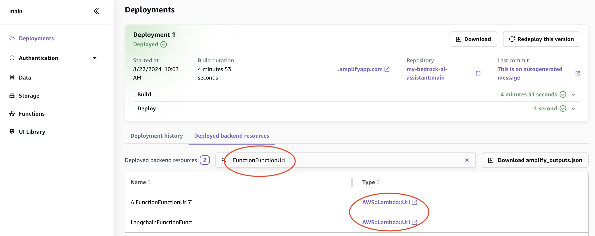
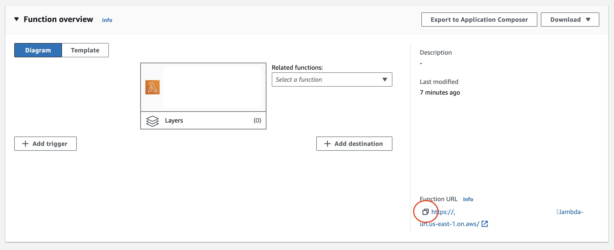

# Create an AI Assistant with AWS Amplify, Amazon Bedrock w/ Tools, AI SDK and LangChain

## Table of Contents

- [Overview](#overview)
- [Key Features](#key-features)
- [Architecture](#architecture)
- [Tech Stack](#tech-stack)
  - [Frontend](#frontend)
  - [Backend](#backend)
- [Deployment Guide](#deployment-guide)
  - [Requirements](#requirements)
  - [Deploy](#deploy)
  - [URL rewrites](#url-rewrites)
- [Local development](#local-development)
- [Security](#security)
- [Contributing](#contributing)
- [License](#license)

## Overview

This project demonstrates how to build an AI Assistant using AWS Amplify, Amazon Bedrock, Vercel AI SDK, and LangChain. With these tools, you can create an AI Assistant capable of providing intelligent responses and performing various tasks efficiently.

## Key Features

- **AWS Amplify Integration**: Seamlessly integrates with Amplify hosting and backend services, facilitating streamlined application deployment.
- **Amazon Bedrock**: Enhances Large Language Model (LLM) capabilities via the Amazon Bedrock Converse API, supporting features like tool invocation and document summarization.
- **Serverless Streaming**: Uses AWS Lambda for response streaming, ensuring optimal performance and scalability.
- **AI SDK**: Utilizes Vercel AI SDK to connect the application with the LLM, delivering a refined user experience.
- **LangChain Support**: Incorporates LangChain to leverage its comprehensive ecosystem and capabilities.

## Architecture

Below is an overview of the application architecture:



## Tech Stack

### Frontend

This application is based on the [AWS Amplify React+Vite Starter Template](https://github.com/aws-samples/amplify-vite-react-template), and it utilizes React with TypeScript. The design is crafted with [Tailwind CSS](https://tailwindcss.com/) and [shadcn components](https://ui.shadcn.com/), using the [dashboard-03 template](https://ui.shadcn.com/blocks#dashboard-03) for a sleek and efficient UI.

For creating a conversational user interface, the `useChat()` hook from the [Vercel AI SDK](https://sdk.vercel.ai/) is employed.

### Backend

The backend is built with AWS services:

- **Lambda Functions**: These functions call the [Bedrock Converse API](https://docs.aws.amazon.com/bedrock/latest/userguide/conversation-inference.html) to send and receive messages from Amazon Bedrock models. Node.js 20 serves as the runtime environment.
- **Model Selection**: Choose from three models supporting tool invocation:
  - Anthropic Claude 3 Haiku
  - Anthropic Claude 3 Sonnet
  - Anthropic Claude 3.5 Sonnet
- **Authentication**: Managed via [Amplify Auth](https://docs.amplify.aws/react/build-a-backend/auth/) and Amazon Cognito.
- **Response Streaming**: Conversations are streamed through Lambda functions with [streaming response](https://docs.aws.amazon.com/lambda/latest/dg/configuration-response-streaming.html).

Two Lambda functions are available to interact with Bedrock Converse API:

- **AI Function**: Uses the [Vercel AI SDK](https://sdk.vercel.ai/).
- **LangChain Function**: Employs [LangChain.js](https://js.langchain.com/v0.2/docs/introduction/).

The interface allows you to select between these two frameworks and test their respective approaches.

## Deployment Guide

### Requirements

Before deploying the assistant, ensure you have access to the following foundation models on Amazon Bedrock:

- Anthropic Claude 3 Haiku
- Anthropic Claude 3 Sonnet
- Anthropic Claude 3.5 Sonnet

Refer to [this guide](https://docs.aws.amazon.com/bedrock/latest/userguide/getting-started.html#getting-started-model-access) for details. The project must be deployed in the same AWS region where these models are available.

### Deploy

To deploy the project, click the button below:

[](https://console.aws.amazon.com/amplify/home#/deploy?repo=https://github.com/MrHertal/bedrock-ai-assistant)

After deployment, configure URL rewriting in your Amplify app.

### URL rewrites

To use Lambda functions with streaming responses, you'll need a function URL, such as `https://XXXXXX.lambda-url.REGION.on.aws/`. By configuring URL rewriting in AWS Amplify, you can mask this URL behind your app's domain, which helps to avoid CORS issues. This means your application will interact with `https://XXXXXX.amplifyapp.com/chat/*` instead of directly accessing the Lambda URL. Access tokens will be verified during Lambda execution. For enhanced security, consider implementing a Web Application Firewall (WAF) as detailed in the [security section](#security).

To configure URL rewrites:

1. In the Amplify console, go to the `Hosting` section and select `Rewrites and redirects`.
2. Click on `Manage redirects`, then choose `Open text editor`.
3. Insert the following configuration:

```json
[
  {
    "source": "/<*>",
    "status": "404-200",
    "target": "/index.html"
  },
  {
    "source": "/chat/ai/<*>",
    "status": "200",
    "target": "https://XXXXXX.lambda-url.REGION.on.aws"
  },
  {
    "source": "/chat/langchain/<*>",
    "status": "200",
    "target": "https://XXXXXX.lambda-url.REGION.on.aws"
  }
]
```

Replace the `target` values with the specific function URLs, ensuring there are no trailing slashes.

To obtain the necessary URLs:

1. From the Amplify console, select the `main` branch to access the latest deployment.



2. In the `Deployed backend resources` tab, search for `FunctionFunctionURL`.



3. Click on `AWS::Lambda::Url` to open the function in the Lambda console.



4. Copy the Lambda function URL.

## Local Development

For local development, you'll use the Amplify [cloud sandbox](https://docs.amplify.aws/react/deploy-and-host/sandbox-environments/setup/), which offers an isolated environment with real-time updates to your cloud resources.

To get started:

1. Clone your repository and install the necessary dependencies:

   ```bash
   npm install
   ```

2. Launch the sandbox environment:

   ```bash
   npx ampx sandbox
   ```

3. Open a new terminal tab and start the development server:

   ```bash
   npm run dev
   ```

4. You can now access [http://localhost:5173](http://localhost:5173).

## Security

This project uses Lambda functions to stream responses via [Lambda URLs](https://docs.aws.amazon.com/lambda/latest/dg/urls-configuration.html). It's important to recognize that these URLs are publicly accessible, so it's advisable to hide them behind your application domain using URL rewrites. Despite this, the endpoints called by your frontend (`https://XXXXXX.amplifyapp.com/chat/*`) remain public. Authentication is verified during Lambda execution, meaning you'll incur charges even if the requests are unauthenticated.

To enhance the security of these endpoints, it's common to implement [AWS WAF](https://docs.aws.amazon.com/waf/). While AWS WAF is not currently natively supported in Amplify, this feature is expected to be available [soon](https://github.com/aws-amplify/amplify-hosting/issues/36#issuecomment-2236797249).

Additionally, Lambda URLs can be protected by placing them behind a CloudFront distribution with origin access control. Although this approach requires some architectural adjustments, we plan to showcase this setup in the near future.

## Contributing

See [CONTRIBUTING](CONTRIBUTING.md) for more information.

## License

This library is licensed under the MIT-0 License. See the [LICENSE file](LICENSE).
